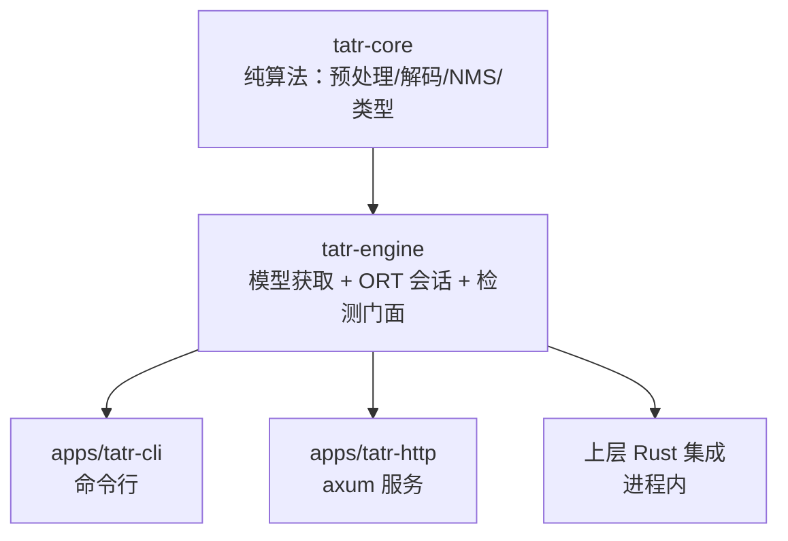

# DESIGN — tatr 架构设计

## 1. 分层



## 2. 模块边界（改代码前先定位层级）

### crates/ — 库层

| crate | 定位 | 允许 | 禁止 |
|---|---|---|---|
| `tatr-core` | **纯算法与契约**：类型（`types`）、预处理（`preprocess`）、解码（`decode`）、NMS（`nms`） | 图像几何、张量约定、解码语义、数学 | ONNX Runtime、文件/网络 IO、日志、配置读取——**必须能无模型单测** |
| `tatr-engine` | **推理与资源**：模型来源解析（`model`）、ORT 会话（`session`）、检测门面（`engine`） | ort 调用、模型下载/校验、会话配置、图像解码 | 业务规则；HTTP/CLI 关注点 |

### apps/ — 应用层

| app | 定位 | 允许 | 禁止 |
|---|---|---|---|
| `tatr-cli` | 命令行：批量检测、模型管理、结果可视化 | 参数解析、JSON 输出、标注图渲染（纯像素操作）、日志 | 复刻算法（一律调 `tatr-core`/`tatr-engine`） |
| `tatr-http` | HTTP 服务：单图检测 | 路由、并发闸门、探针、错误映射 | 复刻算法 |

### 依赖方向（禁止反向）

```
tatr-core ← tatr-engine ← { tatr-cli, tatr-http, 上层集成 }
```

**判据：算法改动落在 `tatr-core`，推理/资源改动落在 `tatr-engine`，接口形态改动落在 `apps/`。**

## 3. 端到端数据流

```
图像字节
  → image 解码为 RGB8                      [tatr-engine::decode_image_bytes]
  → target_size(短边→short_side, 长边≤long_side)   [tatr-core::preprocess]
  → 抗混叠缩放 + /255 + ImageNet 归一化 → NCHW + mask   [tatr-core::preprocess]
  → ONNX Runtime (pixel_values, pixel_mask)          [tatr-engine::session]
  → logits [1,15,3] / pred_boxes [1,15,4]
  → 含 no-object 的 softmax → 真实类别 argmax/max      [tatr-core::decode]
  → 过滤（阈值 / rotated / 退化框）→ clamp 到页面
  → 归一化 cxcywh → 像素 xywh
  → 可选 NMS（默认关闭，DETR 已 query 间去重）          [tatr-core::nms]
  → 检测结果（按分数降序）
```

## 4. 关键设计决策（详见 decisions/）

| 决策 | 影响 |
|---|---|
| ONNX Runtime（`ort`）而非 tch/libtorch | 二进制小、无 Python/torch 运行时、CPU 性能好 |
| 模型走 GitHub Release 资产 + sha256 | 仓库不背 110 MB 二进制；启动期校验 |
| 解码用**含 no-object 的 softmax** | 用按类 sigmoid 会虚高分数并误检（ADR-0002） |
| 缩放必须**抗混叠**（Triangle） | 2-tap 双线性在降采样时混叠，指标掉点（ADR-0003） |
| `include_rotated` 默认 **true** | 实测 +0.006 F1、误检数不变 |
| NMS 默认**关闭** | DETR 每 query 独立出框，开启无增益 |

## 5. 并发模型与 CPU 部署

- `ort::Session::run` 需要 `&mut`，`tatr-engine` 内部用 `Mutex` 串行化——
  CPU 场景这是**期望行为**（避免线程超订）。
- HTTP 层用 `Semaphore` 限制排队长度（`TATR_MAX_CONCURRENCY`，默认 4），
  防止突发流量导致内存无界增长。
- 吞吐扩展靠**多进程/多实例**，不靠单进程加线程（实测 6 线程即饱和）。

## 6. 失败恢复与错误分层

| 阶段 | 失败模式 | 处理 |
|---|---|---|
| 启动 | 模型缺失/哈希不符/ONNX 契约不符 | **启动期即失败**（`TableDetectionEngine::new` 报错），不让坏模型进入服务 |
| 请求 | 图像解码失败 | 400 `invalid_image` |
| 请求 | 参数非法（阈值/尺寸） | 400 `invalid_input` |
| 请求 | 推理异常 | 503 `inference_failed`（可重试） |
| 运行 | ORT 会话中毒 | 503 `overloaded`/`inference_failed` |

## 7. 模型选型现状与演进

当前为 Table Transformer（PubTables-1M 上的权威基线，MIT）。同机实测显示
DocLayout-YOLO（YOLOv10 系）在 TableBank 上 F1 更高（0.810 vs 0.716）但 CPU 慢 3–5×，
且其**代码**为 AGPL-3.0（权重 Apache-2.0）。

**结论**：v0.1 保持 TATR（许可干净 + CPU 快 + 契约已验证）。换模型是独立决策，
需先建立"表格密集页"评测轴（PRD §7.2 的盲区），否则无法判定换模型的真实收益。
候选方案应能复用 `tatr-core` 的预处理/解码抽象——若换 DETR 系只需改模型文件；
换 YOLO 系需新增解码器（`decode` 模块已按"一次解码一种头"隔离）。

## 8. 验证策略

| 层 | 手段 | 说明 |
|---|---|---|
| `tatr-core` | 单元测试（无模型） | 覆盖解码语义、抗混叠性质、PIL 参考对照、边界与退化输入 |
| `tatr-engine` | 构造期错误路径测试 + 端到端 | 模型缺失/契约不符；真实模型推理 |
| 系统 | 基线复跑 | TableBank 固定页集合，F1 必须落在基线 |
| 契约 | 对拍 | Rust ↔ 参考实现（ONNX Runtime/PyTorch）逐图比较 |
