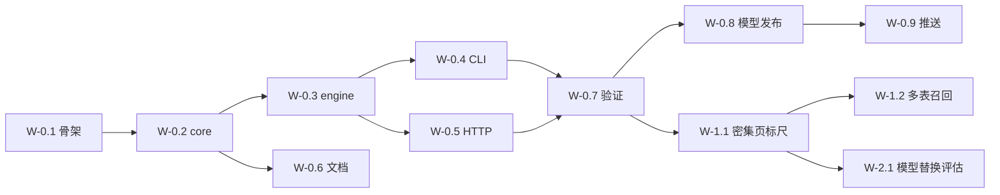

# WBS — tatr 项目主计划

工作包编号 `W-<阶段>.<序号>`。阶段计划的状态以 `plans/` 内 frontmatter 为准，本文件只维护聚合。

## 阶段与状态

| 工作包 | 内容 | 依赖 | 状态 |
|---|---|---|---|
| W-0.1 | 仓库骨架：workspace、rustfmt、toolchain、gitignore | — | ✅ done |
| W-0.2 | `tatr-core`：类型 / 预处理 / 解码 / NMS | W-0.1 | ✅ done |
| W-0.3 | `tatr-engine`：模型来源 + ORT 会话 + 检测门面 | W-0.2 | ✅ done |
| W-0.4 | `apps/tatr-cli` | W-0.3 | ✅ done |
| W-0.5 | `apps/tatr-http`（探针 / 并发闸门 / 优雅退出） | W-0.3 | ✅ done |
| W-0.6 | 文档体系（PRD/DESIGN/WBS/specs/testing/decisions/guides/runbooks） | W-0.2–0.5 | ✅ done |
| W-0.7 | CPU 端到端验证（CLI / HTTP / 基线复跑 / 对拍） | W-0.4, W-0.5 | ✅ done |
| W-0.8 | 模型发布（GitHub Release + sha256 固化） | W-0.7 | ✅ done |
| W-0.9 | 推送 `hexai-cn/tatr` | W-0.6–0.8 | ✅ done |

## 后续（未开始，按价值排序）

| 工作包 | 内容 | 触发条件 |
|---|---|---|
| W-1.1 | **表格密集页评测轴**：单页 10–40 表的真实样本集与指标 | 优先——当前是测量盲区，换模型的收益无法判定 |
| W-1.2 | 多表格页召回提升：现基线多表页纯漏显著高于单表页 | W-1.1 建立后可量化 |
| W-1.3 | 误检压制：纯误检占预测侧多数（见 `testing/baselines.md`） | 需要按误检类型分桶分析 |
| W-1.4 | 复现打包（`.tar.zst`） | 需要多平台制品分发时 |
| W-2.1 | 模型替换评估（DocLayout-YOLO 等） | W-1.1 之后；需评估 AGPL 与 CPU 成本 |
| W-2.2 | 微调数据管线（TableBank train 已具备） | 有明确域且需提升召回时 |

## 依赖图

